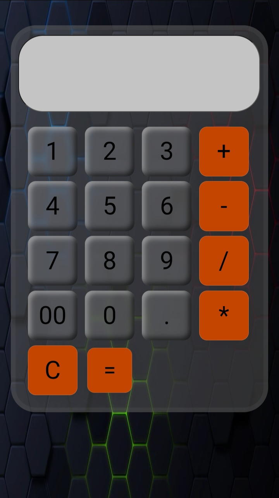

# 🧮 Calculator

A clean, responsive calculator built with **HTML**, **CSS**, and **JavaScript**.  
Perfect for practising DOM manipulation and event handling.

---

## 📸 Demo

Live site → **<https://adityasutar88888.github.io/calculator>**  



---

## ✨ Features

- Basic arithmetic operations (add, subtract, multiply, divide)  
- Clear and delete (backspace) functions  
- Keyboard-friendly input  
- Responsive layout for mobile and desktop

---

## 🚀 Tech Stack

| Tech | Purpose |
|------|---------|
| **HTML5** | Mark-up / structure |
| **CSS3**  | Styling and responsive grid |
| **JavaScript (ES6)** | Calculator logic, DOM updates |
| **GitHub Pages** | Free hosting |

---

## 📂 Project Structure

```bash
calculator/
├── index.html     # Markup
├── style.css      # Styles
└── script.js      # JavaScript logic